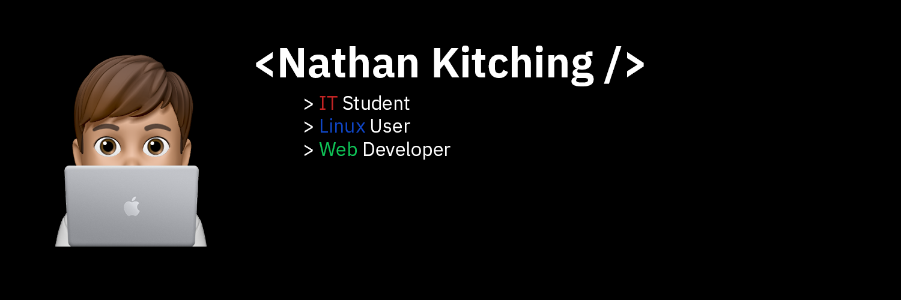

# Hi, I'm Nathan 👋

Specialist User Support Technician based in the North East UK, working across
Windows enterprise environments, M365, Entra ID and Intune. Outside work I'm
into Linux [Arch](https://archlinux.org), self-hosting on a VPS, hardware and software reversing,
and the occasional web project in Next.js.

## What I'm working on

- [nkitch.com](https://nkitch.com) - landing page and portfolio gateway
- [portfolio.nkitch.com](https://portfolio.nkitch.com) - Next.js portfolio with project showcase
- Custom dwm and st builds running on Arch
- Slowly developing into the InfoSec space. hardware hacking, malware and software reversing
- Off the keyboard: BMW E46 build project, motorsport (especially WRC)

## Tech I use

**Languages:** Python, JavaScript, TypeScript, C, C++, HTML/CSS, Bash, PowerShell  
**Frameworks/tools:** Next.js, React, Tailwind, Framer Motion, Git  
**Systems:** Linux (Arch, Debian, Ubuntu Server), Windows enterprise, Nginx,  
basic Docker, Microsoft 365 admin (Entra, Intune, Exchange, SharePoint, Teams)

## Where else to find me

        

